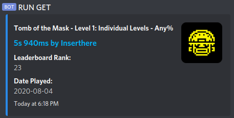
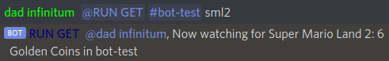

[Invite](https://discordapp.com/oauth2/authorize?client_id=731961127239680051&scope=bot) the bot to your Discord server.

## What It Does

It sends information on recently verified speedruns for any game or runner (on speedrun.com) that you pick.

It can also DM you recent submissions for any game.

## Setting Up Verified Runs

1. Invite RUN GET to your server
2. Make sure it can read messages and send embeds
3. Have the server owner send a message like `@RUN GET #any-text-channel game`

Notes:

* Games must be the abbreviation from speedrun.com (example: Kirby's Dream Land is `speedrun.com/kdl`, so you would use `kdl` as the game)
* Runners must end with an `*` to differentiate them from games (if the runner has their Twitch account linked to speedrun.com, you can use that)
* You can input multiple games and runners at once, but only one channel
* If you want to remove a game or runner, put a `!` before the game or runner
* Send the message `?rungetgames` to get a list of all games and runners being monitored (put an `!` at the end to get the channels, too)

## Setting Up Submitted Runs

1. Be in a server with RUN GET and start a DM
2. Send a direct message like `@RUN GET game`

Notes:

* Games must be formatted like when setting up verified runs
* You can specify a user (with an `*` at the end of the name) and RUN GET will automatically add all games that user moderates
* Like before, to remove a game, put a `!` before the game
* The message `?rungetgames` works here, too

## Running the Bot Yourself

You will need Node.js (nvm is recommended) and yarn. Clone the repository, run `yarn install`, add your Discord API token to `config.js`, then `node index.js` to start the bot.

## Problems?

Submit an issue on [GitHub](https://github.com/slashinfty/run-get/issues/new). If the bot is down for an extended time, reach out to [dad infinitum](https://twitter.com/_dadinfinitum) on Twitter.

## Related Bot

Want to be able to look up speedrunning world records and personal bests in your Discord server? Maybe get a list of categories or category rules? Check out [srcom-bot](https://slashinfty.github.io/srcom-bot).

## Changelog

1 August 2020 - Multiple sub-categories are now read properly.

31 July 2020 - Updated naming of per-level runs.

28 July 2020 - Bot can now watch for verified runs from specific runners.

25 July 2020 - Bot can now DM newly submitted runs.

17 July 2020 - Runs now have a leaderboard rank in the embed.

13 July 2020 - Added `?rungetgames` command. Adding multiple games doesn't short circuit if there's a duplicate.

12 July 2020 - Initial release.

### Special Thanks

Shout out to the [Mobile Speedrunning Discord](https://discord.gg/57fgvS2) for assisting me in testing the bot and suggesting new features.
